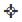

Create your script with the Quamotion Spy
=========================================

To access the 'Spy' page, click on 'Spy' in the top navigation.

The `Spy` page helps to inspect the user interface of an application. When spying you'll be
able to inspect the individual objects of the application's  UI. You can later use these objects in your
automation scripts.

Create a Spy Session
""""""""""""""""""""

To inspect an application it is nessesary to launch the application on a device (i.e. create a session). 

   .. image:: spy-create-session.png
      :width: 100%

1. Select the right platform (Android or iOS).
2. Select the application you want to automate. Only applications corresponding to the selected platform will be displayed.
3. Select the device on which you want to run the application. Only devices corresponding to the selected platform will be displayed.
4. Click 'Start' to start a session. 

A dialog appears showing the progress of starting the session. The dialog disapears once the application is launched 
and the application is ready to be inspected. Both the screenshotfeed and the spy tools appear.

   .. image:: spy-session-started.png
      :width: 100%

Hint: you can collapse the settings pane with the arrow in the upper left corner.

Spy on a paricular object in the screen
""""""""""""""""""""""""""""""""""""""""

Once the session is started you are able to spy on each object in the screen. 

1. Click on an object in the screenshotfeed.
2. The object will be highlighted in a red rectangle.

The `Spy` tab provides more information about the selected object.

* the `Selected object` suggests a xPath which you can use to identify the object.
* the `Object hierarchy` dispays a tree view with all user interface objects of your application which are related to the object you've just selected.

Hint: there is also an option to show the full object hierarchy by clicking on the `full tree` button

   .. image:: spy-element-selected.png
      :width: 100%

Review the properties of a paricular object in the screen
""""""""""""""""""""""""""""""""""""""""""""""""""""""""""

Properties of the selected object are listed in the `Properties` tab.

   .. image:: spy-element-properties.png
      :width: 100%

You can use the text box to filter the properties which are being displayd. e.g. type `access` 
in the text box. and only properties related to accessibility are being displayed.

Use the `Code Generator` to compose a script
""""""""""""""""""""""""""""""""""""""""""""

The `Code Generator` assists in automating your test scenarios.
A script is suggested based on a sequence of actions and validation steps. The steps can be added manually or can be recorded from the device.

The `Code Generator` tab shows all actions and validation steps added since the last page load. By default, this list is empty.

Suggested scripts are made available in different languages on the `Code` tab. 

   .. image:: spy-code-generator-empty.png
      :width: 100%

Add an action manually
''''''''''''''''''''''
1. Select the action or validation step you want to add. The list of available actions is a subset of the possibilies offered in the different clients. 
   Consult the `PowerShell Reference` to see all possibilies.
2. Press `Add`
3. Fill the arguments if nessesary.

.. rubric:: Available elements in the frontend:

+-----------------------+---------------------------------------------------+
| |remove-command|      + Removes the corresponding step                    |
+-----------------------+---------------------------------------------------+
| |reorder-commands|    + Drag this step to another place                   |
+-----------------------+---------------------------------------------------+
| |exit-edit-command|   + Collapse the arguments of the corresponding step  |
+-----------------------+---------------------------------------------------+
| |edit-command|        + Edit the arguments of the corresponding step      |
+-----------------------+---------------------------------------------------+
| |execute-command|     + Executes the corresponding step                   |
+-----------------------+---------------------------------------------------+
| |use-suggested-xpath| + Use the suggested xPath as value of this argument |
+-----------------------+---------------------------------------------------+
| |locate-xpath|        + Locate the xPath in the current screen            |
+-----------------------+---------------------------------------------------+

Record actions
''''''''''''''
1. Press the `Record` button
2. Perform actions on the device.

Click, enter text, back actions are autotmatically added to the list. Each step can be edited, removed or reordered.

View the suggested code
"""""""""""""""""""""""

Code is suggested for the actions and validation steps in the `Code Generator`. Multiple languages can be selected. 
The suggested code can be pasted and edited in the appropriate editor.

   .. image:: spy-code.png
      :width: 100%