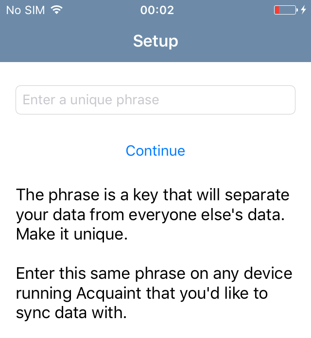

.. role:: definition(strong)

.. default-role:: definition

.. header::

   .. oddeven::

      .. class:: headertable

      +---+---+----------------+
      |   |   |.. class:: right|
      |   |   |                |
      |   |   |Page ###Page### |
      +---+---+----------------+

      Page ###Page###

      .. class:: headertable
      
      +---+---+----------------+
      |   |   |.. class:: right|
      |   |   |                |
      |   |   |Page ###Page### |
      +---+---+----------------+

Mobile Test Automation with Quamotion
=====================================

.. contents::

.. raw:: pdf

   PageBreak oneColumn
   SetPageCounter 1

About This Lab
--------------

Estimated time to complete this lab: **60 minutes**

You can review the latest version of this lab on-line at
http://docs.quamotion.mobi/en/latest/hands-on-lab/acquaint

Lab Objectives
~~~~~~~~~~~~~~

This lab provides an end-to-end tour of the Quamotion Webdriver. You will start with a brief
exploration of the Quamotion UI, and then move on to an introduction on mobile test automation.

You will learn how to install a mobile app on a mobile device. Next, you will learn how to
inspect the user interface of a mobile app and to automate individual user interactions with
that mobile app. You will then use that knowledge to automate a full end-to-end scenario.
Finally, you'll learn how use the mobile quality dashboard to assess the quality of your
mobile app on different devices and platforms.

After completing this lab, you will be better able to:

* Use the Quamotion user interface
* Identify the elements that make up the user interface of a mobile app
* Automate user interactions with the mobile app
* Create mobile test automation scripts
* Run mobile test automation scripts
* Assess the quality of your mobile app

Technologies
~~~~~~~~~~~~

In this hands on lab, you'll use the following technologies:

* Quamotion for Windows
* PowerShell
* Java, JUnit and IntelliJ
* C#, NUnit and Visual Studio

Audience
~~~~~~~~

This hands on lab targets the following audience:

* Test automation engineers

Feedback
~~~~~~~~

We welcome your feedback on this lab! If you've found an issue, have questions or just got stuck
while executing this lab, you can leave your feedback:

* With the Quamotion team at the Quamotion booth
* In the Disqus section at the on-line version of this lab
* On the GitHub site at http://github.com/quamotion/docs

Getting Started
---------------

Connect to the Lab Environment
~~~~~~~~~~~~~~~~~~~~~~~~~~~~~~

Ensure you are logged on to the Quamotion machine as a normal user.

Open the Lab Environment
~~~~~~~~~~~~~~~~~~~~~~~~

1. Make sure you have the latest version of the demo application available. In this lab, we'll
   use the Acquaint app. The table below lists the download links for the Acquaint app.
   Download the Acquaint app and save the files on the lab machine.

   +-------------------+----------------------------------------------------------+
   | Android           | http://cdn.quamotion.mobi/apps/acquaint-android-151.apk  |
   +-------------------+----------------------------------------------------------+
   | iOS               | http://cdn.quamotion.mobi/apps/acquaint-ios-151.ipa      |
   +-------------------+----------------------------------------------------------+

2. Make sure at least an iOS device (such as an iPhone) and an Android device (such as a Google Nexus device)
   are connected to the lab machine. Verify the devices are connected to the lab machine using an USB cable.
3. If the Quamotion software is not already running, start it by launching ``Quamotion.WebDriver.exe``. Leave
   the main executable running in the background.
4. To begin the lab, on the lab machine, start a browser, such as Google Chrome, and navigate
   to the Quamotion user interface at http://localhost:17894/.

Excercise 1 - Explore the Quamotion User interface
--------------------------------------------------

Estimated time to complete this excercise: **15 minutes**

Scenario
~~~~~~~~

In this introduction to the Quamotion User Interface, you will open the Quamotion user Interface and
explore the different components of the user interface. You will see that Quamotion provides you a single
entry point to manage your apps, your devices and the results of your test campaigns.

Task 1 - Applications in Quamotion
~~~~~~~~~~~~~~~~~~~~~~~~~~~~~~~~~~

In this task, you will access the `Apps` page, add the Acquaint application and list all applications
which are available for testing.

1. Ensure that you are connected to the Quamotion machine as a normal user.
2. Start a browser and navigate to http://localhost:17894/
3. In the top navigation, click `Apps`.
4. You will now see a list of all applications which are available for testing. By default, this list is empty.

   .. image:: apps-empty.png
      :width: 100%

5. At the bottom of the page, click the `New` button. The `New App` dialog appears
6. Click the `Choose File` button, and select the ``acquaint-ios-151.ipa`` file which
   you've downloaded earlier.
7. Click `Add` to add the application.
8. The `New App` dialog closes, and the `Apps` screen becomes visible. The Acquaint app
   is now listed in the list of available applications.

   .. image:: apps-acquaint.png
      :width: 100%

9. Click on the Acquaint app. A dialog box opens with additional information about the app. You can also
   download the app, or delete the app, from within this dialog box.

Task 2 - Devices in Quamotion
~~~~~~~~~~~~~~~~~~~~~~~~~~~~~

In this task, you will access the `Devices` page, connect and disconnect a device to your PC, and notice
how the `Devices` page automatically refreshes.

1. In the top navigation, click `Devices`.
2. You will see a list of all iOS and Android devices which are available for testing. If no iOS or Android 
   devices are devices to your PC using an USB cable, this list is empty.
   
   .. image:: devices-empty.png
      :width: 100%

3. Connect an iOS device to your PC. The `Devices` page will automatically update, and list the new iOS device
   which you have connected. 
   
   .. image:: devices-ios.png
      :width: 100%

4. Click on the iOS device you have connected. A dialog appears, which shows additional information about your
   device.

5. Unplug the USB cable of your iOS device from your PC. The device is removed from the `Devices` screen.

Task 3 - Spying the user interface of an application
~~~~~~~~~~~~~~~~~~~~~~~~~~~~~~~~~~~~~~~~~~~~~~~~~~~~

In this task, you'll use the `Spy` page to spy on the user interface of an application. When spying you'll be
able to inspect the individual elements of the application's  UI. You can later use these elements in your
automation scripts.

You'll see how to write automation scripts in a next excercise.

1. In the top navigation, click `Spy`. The `Spy` page opens.
   
   .. image:: spy-empty.png
      :width: 100%

2. The `Spy` page allows you to launch an app on a device, and inspect the user interface of that app. To launch
   the app, you'll first need to specify which app you want to run, and on which device you want to run it.

   In the `Platform` dropdown, select `iOS`, in the `App` dropdown, select `Acquaint N`, and in the `Device`
   dropdown, select your iOS device.

   .. image:: spy-starting-top.png
      :width: 100%

3. After a couple of seconds, the screen of your device will be mirrored in your browser.

   .. image:: spy-starting-bottom.png
      :width: 100%

4. Click `Start` to install and launch your application on the device. Wait for your application to launch.

5. You can now inspect the user interface of your app. Click any element in the user interface. The element
   will be highlighted in a red rectangle.

   .. image:: spy-running.png
      :width: 100%

6. Review the contents in the lower right of your browser window. You'll see a tree view, which represents
   all user interface elements of your application which are related to the element you've just selected.
   The tree view contains the XPath expression which you can use to identify the element and, where available,
   the ID, text or accessibility label of the element.

   .. image:: spy-tree-details.png
      :width: 50%

7. Review the contents in the upper right of your browser window. You'll see a table, which contains additional
   information about the element you've just selected. You'll see the XPath you can use to identify the element,
   as well as some additional information, such as the class name, ID and rectangle.

   .. image:: spy-xpath-details.png
      :width: 75%

8. Click on the `Play` icon. Additional properties of the element which you've selected are now displayed.
   You can use the text box to filter the properties which are being displayd. Type `access`
   in the text box. Now only properties related to accessibility are being displayed.

   .. image:: spy-xpath-properties.png
      :width: 75%

Task 4 - Using the Mobile App Quality Dashboard
~~~~~~~~~~~~~~~~~~~~~~~~~~~~~~~~~~~~~~~~~~~~~~~

In this task, you'll use the `Dashboard` app to view the results of the test scripts you've executed.

1. In the top navigation, click `Dashboard`. The `Dashboard` page opens.
   
   .. image:: dashboard.png
      :width: 100%

2. The two top pie charts in the `All Results` section display the number of tests you've executed,
   and the number of devices on which you've executed those tests.

3. The `Key Metrics` section displays key metrics about your test campaign - such as the total device
   time, the number of devices and operating systems, and the size of the application under test.

4. The `Failure Breakdown` section displays the test results by operating system, form factor and
   manufacturer.

5. You can click any link the failure breakdown section to view more information about those failures.
   Click on any link in the operatig system section.

6. The `Test Result Details` page will appear. This page contains all tests you've executed which match
   the criteria you've specified. 

   .. image:: test-result-details.png
      :width: 100%

7. Click on any test in the test results list.

8. The test report appears. The test report contains a detailed view of all steps that have been
   executed in the test report, including screenshots.

   .. image:: test-report.png
      :width: 100%

Excercise 2 - Automate the iOS Acquaint app
-------------------------------------------

Estimated time to complete this excercise: **30 minutes**

Scenario
~~~~~~~~

In this scenario, you'll automate the iOS version of the Acquaint application. The Acquaint app is a simple
list of contacts, each of which can be viewed in a detail screen and modified in an edit screen. It runs on iOS 9
and above.

You will learn how to:

* Create a mobile test automation script
* Automatically launch an application on a mobile device
* Automate user interactions, such as scrolling, tapping and typing text
* Analyze the test results

Task 1 - Explore the Acquaint application
~~~~~~~~~~~~~~~~~~~~~~~~~~~~~~~~~~~~~~~~~

You'll first explore the Acquaint application. You will now manually execute the scenario you will later automate.

1. On your iOS device, if it is not already active, launch the Acquaint app. The Acquaint app was installed
   previously on your device when you launched the spy.

2. If you are requested to connect to a data source, enter the value ```UseLocalDataSource`` as the data source
   and continue to the next page.

3. In the list of acquaintances, scroll down until you find `Green, Monica`. Tap `Green, Monica`.

4. The details page for Monica Green will now open, including a mapp which visualizes her address. Tap the pencil
   icon in the upper right corner of the device to edit her details.

5. Scroll down until you find the `ZIP` field in the contact details.

6. Tap the zip code. The on screen keyboard of your device will now appear. Enter a new zip code, for example,
   `100 44`, which is the zip code for Stockholm.

7. Tap the save icon in the upper right corner of the app to save your changes. Make sure the zip code is displayed
   correctly.

8. Tap `List` to go back to the main screen.

Task 2 - Create a script which launches the application
~~~~~~~~~~~~~~~~~~~~~~~~~~~~~~~~~~~~~~~~~~~~~~~~~~~~~~~

In this task, you'll create your first mobile test automation script. There are plug-ins for Quamotion that allow
you to write tests in Java, C# or PowerShell. 

In this task, you'll use PowerShell. Because PowerShell is a scripted language, and not a compiled language, it
is easier to create and edit scripts as you go. However, all the scripts you're about the write in PowerShell
could easily be written in Java or C#.

If you're using the Quamotion machine, PowerShell is already installed. PowerShell is also available on Windows
by default. If you're using Linux or macOS, download PowerShell from https://github.com/PowerShell/PowerShell/

Because Quamotion is based on the WebDriver protocol, it also implements most of the concepts of WebDriver.
One fundamental concept in WebDriver is the notion of a `session`. You can think of a session as a test run.
In the context of Quamotion, a `session` is an application running on a device.

When you start a new test script, the first step is usually to create a session. You can do so using the
``New-Session`` command. When starting a session, you specify the application you want to launch (by its
unique ID and version number) and the device on which you want to launch the application (by its serial number).

You can use the portal to get the unique ID and version number of the mobile app and the serial number of the device,
or you can use the ``Get-App`` and ``Get-Device`` commands in PowerShell.

1. As a first step, open PowerShell. Click `Start`, type `PowerShell` and hit ENTER. The PowerShell console
   will now open.

   .. image:: powershell.png
      :width: 100%

2. Next, you'll need to import the Quamotion module into your PowerShell session. Assuming you've installed
   the Quamotion software to ``C:\Quamotion``, type the following command and hit ENTER:

   .. code-block:: powershell

      PS> Import-Module C:\Quamotion\wdclient.psm1

3. To get the application ID and version number of the Acquaint app, run the `Get-App` command:

   .. code-block:: powershell

      PS> Get-App

      AppId                   : demo.quamotion.Acquaint
      DisplayName             : Acquaint N (1.51)
      Version                 : 1.51
      VersionDisplayName      : 1.51
      SupportedConfigurations : @{OperatingSystem=iOS; [..]}
      TestServerVersion       :

4. Note that the application ID is ``demo.quamotion.Acquaint`` and the version number is
   ``1.51``.

5. To get the unique ID of your device, run the `Get-Device` command:

   .. code-block:: powershell

      PS> Get-Device

      configuration  : @{OperatingSystem=iOS; [..]}
      deviceRotation : None
      manufacturer   : Apple
      model          : iPhone6,2
      name           : iPhone
      providerId     : 61fee998-7171-4b09-9d8a-511136d30ec9
      resolution     : @{x=0; y=0; width=640; height=1136}
      serialNumber   : 221373bf136e8e8962fe978e74f4c92af330c6ba
      state          : Started
      type           : Physical
      uniqueId       : 221373bf136e8e8962fe978e74f4c92af330c6ba
      viewPort       : @{x=0; y=0; width=640; height=1136}
      deviceModel    : @{[..]}

6. A lot of information about your device is provided to you. Write down the unique ID,
   ``221373bf136e8e8962fe978e74f4c92af330c6ba`` in this case.

   .. note::

     Because the unique ID uniquely identifies the device, you may obtain a different unique ID
     with your iOS device.

7. To start a new session on the device, run ``New-Session`` command. Specify the unique ID of your
   device using the ``-deviceId`` parameter and the ID and version of your app using the
   ``appId`` and ``appVersion`` parameters, respectively.

   Because the Acquaint app stores the secret key you've used, you may want to reinstall the application
   on the device every time you create a new session. This way, you're sure your application starts
   in a clean state, every time you run a test.

   Finally, because only one app can run on a device at the same time, you may want to remove any
   previous session. You can do so using the ``Get-Sessions | Remove-Session`` command

   .. code-block:: powershell

     PS> Get-Sessions | Remove-Session
     PS> New-Session 
           -deviceId 221373bf136e8e8962fe978e74f4c92af330c6ba
           -appId demo.quamotion.Acquaint
           -appVersion 1.51
           -reinstallApp $true 

     The session b59649cb-6324-400b-923c-8384b4fcd6f3 is Deploying: [..]
     The session b59649cb-6324-400b-923c-8384b4fcd6f3 is Deploying: [..]
     The session b59649cb-6324-400b-923c-8384b4fcd6f3 is Deploying: [..]


Task 3 - Automate the Acquaint setup
~~~~~~~~~~~~~~~~~~~~~~~~~~~~~~~~~~~~

The first time you launch Acquaint, it will ask you to configure a unique passphrase.
In this task, you'll write a script which enters the unique passphrase and then taps
`Continue`.



To automate gestures on controls, such as tapping, you can use PowerShell functions
like `Click-Element`. When automating a gesture, you need to instruct Quamotion on
which user interface element you want your script to perform the gesture.

There are various ways to identify an control. You can identify a control by
the text it displays, its accessibility label or its unique ID (if one is assigned
to the control by the application's developers). Alternatively, you can also
specify the control's class name or provide an XPath expression which uniquely
identifies the control. To retrieve the class name or XPath expression, you can use
the `Spy` window you've explored in the previous excercise.

To type text, you can use the `Enter-Text` PowerShell function.

In this case, we want to enter text in the text box which displays the text 
`Enter a unique phrase`. You can pass the ``-marked`` parameter to the ``Click-Element``
function to instruct the ``Click-Element`` function to click on that control.

1. To simulate a tap on the text box which displays the text `Enter a unique phrase`,
   enter the following command in PowerShell:

   .. code-block:: powershell

     PS> Click-Element -marked "Enter a unique phrase"
    
2. The on-screen keyboard will now appear 

   .. image:: acquaint-setup-entering-text.png
     :width: 33%

   Type ``Enter-Text "UseLocalDataSource"`` to simulate the user typing the 
   `UseLocalDataSource` text

   .. code-block:: powershell

     PS> Enter-Text "UseLocalDataSource"

3. Finally, you can simulate a tap on the `Continue` button by using the ``Click-Element``
   method.

   .. code-block:: powershell

     PS> Click-Element -marked "Continue"

   The application will now launch the `Acquaintances` screen.

Task 4 - Open acquaintance details
~~~~~~~~~~~~~~~~~~~~~~~~~~~~~~~~~~

In this task, you'll open the details page for an acquaintance.
You'll use an acquaince with a last name which starts with 'T' requiring you write a script
which scrolls down to that acquaintance in the contact list.

To scroll down to an element, use the ``Scroll-To`` method. However, you need to specify
which scroll view you want to scroll in. To obtain a reference to the scroll view, you
can use the ``Get-Element`` function. Because scroll views on iOS implement the ``UITableView``
class, you can search by class.

1. To scroll down to the `Thornton, Vanessa` contact, run the following code:

   .. code-block:: powershell

     PS> $scrollView = Find-Element -class "UITableView"
     PS> Scroll-To -elementId $scrollView -marked "Thornton, Vanessa"

   The application will now scroll down the main scroll view, until the `Thornton, Vanessa`
   acquaintance is visible.

2. To open the details for Vanessa, use the ``Click-Element`` function:

   .. code-block:: powershell

     PS> Click-Element -marked "Thornton, Vanessa"

   Vanessa's contact details will appear.

Task 5 - Edit acquaintance details
~~~~~~~~~~~~~~~~~~~~~~~~~~~~~~~~~~

Once you've opened the contact card for Vanessa, you'll want to automate a tap on the edit icon,
represented by the pencil, in the upper right of the screen.

Because this icon does not contain any visual text, you cannot use the ``Click-Element`` function
with the ``-marked`` parameter like we've done previously. Instead, you'll need to open the `Spy`.

1. In your browser, navigate to the `Spy` page.
2. Select the `iOS` platform, the `Acquaint` app and your device. Because you've already opened
   a session for the Acquaint app on your device, you'll also need to check the
   `Reuse an existing session if available` check box.
3. Click `Start` to start the spy.
4. In the mirror of your devices screen in your browser, click the pencil icon.

   .. image:: acquaint-details-spy.png
     :width: 100%

5. Note how the details section also displays the unique ID of the edit icon.

   .. image:: acquaint-details-properties.png
     :width: 100%

6. Now you know the unique ID of the edit icon is ``edit``, you can use the ``Click-Element``
   method to automate a click:

   .. code-block:: powershell

     PS> Click-Element -marked "edit"

   The edit screen will apear.

7. To update the zip code, you'll first need to scroll down to the `ZIP` entry. You can use the same
   technique you've learned in the previous step:

   .. code-block:: powershell

     PS> $scrollView = Find-Element -class "UITableView"
     PS> Scroll-To -elementId $scrollView -marked "ZIP"

8. To edit the zip code, similate a tap on the current zip code (`94070`):

   .. code-block:: powershell

     PS> Click-Element -marked "94070"

9. Clear the text, enter a new zip value and dismiss the keyboard to stop editing:

   .. code-block:: powershell

     PS> Clear-Text
     PS> Enter-Text 100 44
     PS> Dismiss-Keyboard

10. Finally, navigate back to the main list of acquaintances by tapping `Details` and `List`:

    .. code-block:: powershell

      PS> Click-Element -marked "Details"
      PS> Click-Element -marked "List"

Review
~~~~~~

In this task, you've used PowerShell and the `Spy` to automate a scenario in the Acquaint app.

You've written the following PowerShell script which sets up Acquaint and edits the contact details
of an acquaintance:

.. code-block:: powershell

  Import-Module C:\Quamotion\wdclient.psm1
  
  # Kill any sessions which are still running
  Get-Sessions | Remove-Session 

  # Launch the application on the device
  New-Session
    -deviceId 221373bf136e8e8962fe978e74f4c92af330c6ba
    -appId demo.quamotion.Acquaint
    -appVersion 1.51
    -reinstallApp $true

  # Set up Acquaint: provide a passphrase and tap Continue
  Click-Element -marked "Enter a unique phrase"
  Enter-Text "UseLocalDataSource"
  Click-Element -marked "Continue"

  # Open the details for Vanessa Thornton
  $scrollView = Find-Element -class "UITableView" 
  Scroll-To -elementId $scrollView -marked "Thornton, Vanessa"
  Click-Element -marked "Thornton, Vanessa"

  # Click the edit button
  Click-Element -marked "edit"

  # Scroll to the ZIP field
  $scrollView = Find-Element -class "UITableView"
  Scroll-To -elementId $scrollView -marked "ZIP"

  # Change the Zip code
  Click-Element -marked "94070"
  Clear-Text
  Enter-Text "100 44"
  Dismiss-Keyboard

  # Go back to the main acquaintances list
  Click-Element -marked "Details"
  Click-Element -marked "List"

Excercise 2 - Automate the Android Acquaint app
-----------------------------------------------

Estimated time to complete this excercise: **30 minutes**

Scenario
~~~~~~~~

In this scenario, you'll automate the Android version of the Acquaint application. The Acquaint app is a simple
list of contacts, each of which can be viewed in a detail screen and modified in an edit screen. It runs on Android 4
and above.

You will learn how to:

* Create a mobile test automation script
* Automatically launch an application on a mobile device
* Automate user interactions, such as scrolling, tapping and typing text
* Analyze the test results

Task 1 - Install the Acquaint application on your device
~~~~~~~~~~~~~~~~~~~~~~~~~~~~~~~~~~~~~~~~~~~~~~~~~~~~~~~~

Connect your Android device to your PC. In the previous excercise, the Acquaint application
was installed on your device the first time you launched the `Spy`.

In this excercise, you'll upload and install the Acquaint app on the Android device using PowerShell.
To upload an application to Quamotion, you can use the ``Add-App`` function. It takes one parameter,
the full path to the application.
To install an application, you can use the ``Install-App`` function. This function takes three
parameters, the ID of the device on which you want to install the app, the app ID and app version.

1. Open PowerShell. Click `Start`, type `PowerShell` and hit ENTER. THe PowerShell console will
   now open.

2. Import the Quamotion module in your PowerShell session. Assuming you've installed Quamotion
   to ``C:\Quamotion``, type the following command and hit ENTER:

   .. code-block:: powershell

      PS> Import-Module C:\Quamotion\wdclient.psm1

3. To add the Acquaint app, type the following command and hit ENTER. If you have downloaded the Acquaint
   application to a different location than ``C:\Quamotion``, make sure to specify the correct path.

   .. code-block:: powershell

      PS> Add-App C:\Quamotion\demo.quamotion.acquaint.apk                                                                                                                                                     

      AppId                   : demo.quamotion.acquaint
      DisplayName             : Acquaint N (1.51)
      Version                 : 151
      VersionDisplayName      : 1.51
      SupportedConfigurations : @{[..]}
      TestServerVersion       :

   The ``Add-App`` command provides you with information about the app you've just uploaded. For example,
   we now know that the app ID is ``demo.quamotion.acquaint``, and the Version is ``151``.

4. To install the Acquaint app on your device, you'll first need to get the unique ID of your Android
   device. You can use the ``Get-Device`` command to do that:

   .. code-block:: powershell

      PS> Get-Device                                                                                                                                                     

     configuration  : @{[..]}
     deviceRotation : None
     manufacturer   : asus
     model          : K013
     name           : K013
     providerId     : ef64b429-9c24-4d4d-a926-5ed446028c05
     resolution     : @{x=0; y=0; width=800; height=1280}
     serialNumber   : EAOKCY112414
     state          : Started
     type           : Physical
     uniqueId       : EAOKCY112414
     viewPort       : @{x=0; y=0; width=800; height=1280}
     deviceModel    : @{[..]}

5. You are now ready to install the Acquaint app on your device. Use the ``Install-App`` command and
   specify the App ID, App Version and Device Unique ID values you've obtained in the previous steps:

   .. code-block:: powershell

    PS> Install-App 
            -deviceId EAOKCY112414
            -appId demo.quamotion.acquaint
            -appVersion 151

    StatusCode        : 200
    [..]

6. The `Acquaint N` app is now installed on your Android device. You can manually launch the Android N
   application by clicking its application icon.

Task 2 - Explore the Android Acquaint application
~~~~~~~~~~~~~~~~~~~~~~~~~~~~~~~~~~~~~~~~~~~~~~~~~

In the previous task, you've launched the Acquaint application on your Android device.
In this task, you'll manually explore the Acquaint application. 
Once you've completed this task, you are ready to automate the Acquaint application
in the next task.

1. If you are requested to connect to a data source, enter the value ```UseLocalDataSource`` as the data source
   and continue to the next page.

2. In the list of acquaintances, scroll down until you find `Green, Monica`. Tap `Green, Monica`.

3. The details page for Monica Green will now open, including a mapp which visualizes her address. Tap the pencil
   icon in the upper right corner of the device to edit her details.

4. Scroll down until you find the `ZIP` field in the contact details.

5. Tap the zip code. The on screen keyboard of your device will now appear. Enter a new zip code, for example,
   `100 44`, which is the zip code for Stockholm.

6. Tap the save icon in the upper right corner of the app to save your changes. Make sure the zip code is displayed
   correctly.

7. Tap `List` to go back to the main screen.

Task 3 - Create a script which launches the application
~~~~~~~~~~~~~~~~~~~~~~~~~~~~~~~~~~~~~~~~~~~~~~~~~~~~~~~

In this task, you'll use PowerShell to create a script which launches the Acquaint application, just like
you've done in the previous excercise. You'll learn how to implement the same scenario in Java and C# in
the following excercises.

1. To start a new session on the device, run the `New-Session` command. Specify the
   unique ID of your device, the ID of your app and the version of your App using the
   `-deviceId`,  `-appId` and `-appVersion` parameters. You've obtained these values in the
   first task of this excercise.

   .. code-block:: powershell

    PS> Get-Sessions | Remove-Session
    PS> New-Session
          -deviceId EAOKCY112414
          -appId demo.quamotion.acquaint
          -appVersion 151
          -reinstallApp $true
    
    The session 030cbe05-c2e5-49be-aaa0-a3a3f12b0436 is Deploying: [..]

Task 4 - Automate the Acquaint setup
~~~~~~~~~~~~~~~~~~~~~~~~~~~~~~~~~~~~

The first time you launch Acquaint, you'll be asked to provide a unique passphrase.
In this task, you'll write a a script which types in the unique passphrase and then
taps `Continue`.

Just like iOS, you can use the `Click-Element` and `Enter-Text` functions to automate
these actions.

1. To simulate a tap on the text box which displays the `Enter a unique phrase`, execute the
   following PowerShell command:

   .. code-block:: powershell

     PS> Click-Element -marked "Enter a unique phrase"

2. The on-screen keyboard will now appear, indicating your application is ready to receive
   keyboard input.

   Enter the following command to simulate the user typing the `UseLocalDataSource` text.

   .. code-block:: powershell

     PS> Enter-Text "UseLocalDataSource"


   .. image:: acquaint-android-setup-entering-text.png
     :width: 33%

3. Finally, you can simulate the user tapping the `Continue` button:

   .. code-block:: powershell

     PS> Click-Element -marked "Continue"

   The `Acquaintances` screen will now load:

   .. image:: acquaint-android-acquaintances.png
     :width: 33%

Task 5 - Open acquaintance details
~~~~~~~~~~~~~~~~~~~~~~~~~~~~~~~~~~

In this task, you'll open the details page for an acquaintance. You'll use an acquaintance with
a last name which starts with 'T' requiring you to write a script which scrolls down to that
acquaintance in the contact list.

Like on iOS, you can use the `Scroll-To` method to scroll down to an element. You
need to specify a reference to the scroll view you want to scroll in. To obtain a reference
to the scroll view, you can use the `Get-Element` function. On Android, scroll views inherit
from the `SwipeRefreshLayout` class.

1. To scroll down to the `Thornton, Vanessa` contact, run the following code:

   .. code-block:: powershell

     PS> $scrollView = Find-Element -class "SwipeRefreshLayout"
     PS> Scroll-To -elementId $scrollView -marked "Thornton, Vanessa"

2. To open the details for Vanessa, use the ``Click-Element`` function:

   .. code-block:: powershell

     PS> Click-Element -marked "Thornton, Vanessa"

   Vanessa's contact details will appear

Task 6 - Edit acquaintance details
~~~~~~~~~~~~~~~~~~~~~~~~~~~~~~~~~~

Once you've opened the contact card for Vanessa, you'll want to automate a tap on
the edit icon, represented by the pencil in the upper right corner of the screen.

Because this icon does not contain any visual text, you cannot use the ``Click-Element``
function with the ``-marked`` parameter like we've done previously. Instead, you'll
need to open the `Spy`.

1. In your browser, navigate to the `Spy` page.
2. Select the `Android` platform, the `Acquaint N` app and your device. Because you've
   already opened a session for the Acquaint app on your device, you'll also need to check
   the `Reuse an existing session if available` check box.
3. Click `Start` to start the spy.
4. In the mirror of your device screen in your browser, click the pencil icon.

   .. image:: acquaint-android-details-spy.png
     :width: 100%

5. Note how the details section also displays the unique ID of the edit icon.

   .. image:: acquaint-android-details-properties.png
     :width: 100%

6. Now you know the unique ID of edit icon is ``acquaintanceEditButton``, you can
   use the ``Click-Element`` method to automate a click:

   .. code-block:: powershell

     PS> Click-Element -marked "acquaintanceEditButton"

   The edit screen will appear.

7. To update the zip code, you'll first need to scroll down to the `ZIP` entry. You
   can use the same technique you've learned in a previous step; but not that this time,
   you'll have to use the ``LinearLayout[@marked='acquaintanceEditContentLayout']`` XPath
   expression to find the scroll container:

   .. code-block:: powershell

     PS> $scrollView = Find-Element
           -xpath LinearLayout[@marked='acquaintanceEditContentLayout']
     PS> Scroll-To -elementId $scrollView -marked "ZIP"

8. To edit the zip code, simulate a tap on the current zip code (``94070``):

   .. code-block:: powershell

     PS> Click-Element -marked "94070"

9. To clear the text, enter a new zip value and dismiss the keyboard to stop editing:

   .. code-block:: powershell
  
     PS> Clear-Text
     PS> Enter-Text "100 44"
     PS> Dismiss-Keyboard

10. Finally, navigate back to the main list of acquaintances by tapping the back
    arrow. Use the Spy to obtain the ID of the back button, which is ``ImageButton[1]``:

    .. code-block:: powershell

      PS> Click-Element -xpath "ImageButton[1]"
      PS> Click-Element -xpath "ImageButton[1]"

Review
~~~~~~

In this task, you've used PowerShell and the `Spy` to automate a scenario in the Acquaint app.

You've written the following PowerShell script which sets up Acquaint and edits the contact details
of an acquaintance:

.. code-block:: powershell

  Import-Module C:\Quamotion\wdclient.psm1
  
  # Kill any sessions which are still running
  Get-Sessions | Remove-Session 

  # Launch the application on the device
  New-Session
    -deviceId EAOKCY112414
    -appId demo.quamotion.acquaint
    -appVersion 151
    -reinstallApp $true

  # Set up Acquaint: provide a passphrase and tap Continue
  Click-Element -marked "Enter a unique phrase"
  Enter-Text "UseLocalDataSource"
  Click-Element -marked "Continue"

  # Open the details for Vanessa Thornton
  $scrollView = Find-Element -class "UITableView" 
  Scroll-To -elementId $scrollView -marked "Thornton, Vanessa"
  Click-Element -marked "Thornton, Vanessa"

  # Click the edit button
  Click-Element -marked "acquaintanceEditButton"

  # Scroll to the ZIP field
  $scrollView = Find-Element
    -xpath LinearLayout[@marked='acquaintanceEditContentLayout']
  Scroll-To -elementId $scrollView -marked "ZIP"

  # Change the Zip code
  Click-Element -marked "94070"
  Clear-Text
  Enter-Text "100 44"
  Dismiss-Keyboard

  # Go back to the main acquaintances list
  Click-Element -xpath "ImageButton[1]" 
  Click-Element -xpath "ImageButton[1]" 

Excercise 3 - Create a Java JUnit test for Acquaint
---------------------------------------------------
 
In this excercise, you will create a JUnit test in Java which uses Java to automate the tests you've created
in the previous excercises.

Task 1 - Create a new JUnit project
~~~~~~~~~~~~~~~~~~~~~~~~~~~~~~~~~~~

To create a new JUnit project in IntelliJ:

1. Start IntelliJ
2. Click `File`, `New` and `Project`
3. Select `Maven`, and set the `Project SDK` to at least 1.8
4. Complete the `GroupId`, `ArtificatId` and `Version` fields.
5. Complete the `Project Name` and `Location` fields

Task 2 - Add the required dependencies to your project
~~~~~~~~~~~~~~~~~~~~~~~~~~~~~~~~~~~~~~~~~~~~~~~~~~~~~~

As a next step, you'll add the required dependencies to your project.

1. In the `Dependencies`, add the following code between the ``<project>`` and ``</project>`` tags:
 
   .. code-block:: xml

     <dependencies>
         <dependency>
             <groupId>junit</groupId>
             <artifactId>junit</artifactId>
             <version>4.12</version>
         </dependency>
         <dependency>
             <groupId>org.seleniumhq.selenium</groupId>
             <artifactId>selenium-java</artifactId>
             <version>2.53.0</version>
         </dependency>
     </dependencies>

2. IntelliJ will ask you to import the changes in the Maven project. Click `Import Changes`.

   .. image:: intellij-import-changes.png
     :width: 50%

Task 3 - Add the Quamotion library to your project
~~~~~~~~~~~~~~~~~~~~~~~~~~~~~~~~~~~~~~~~~~~~~~~~~~

Next, you'll add the ``QuamotionDriver.Java`` library to your project. This
library will allow you to automate iOS and Android applications from within your Maven project.

1. Right-click your project and select `Open Module Settings`

   .. image:: intellij-open-module-settings.png
     :width: 50%

2. Click `Libraries`
3. Click the plus (+) icon to add a library
4. Select `Java`
5. Add the ``QuamotionDriver.Java.jar`` file, which is available for download at http://qmcdn.blob.core.windows.net/download/QuamotionDriver-Java.jar
6. Click `OK`
7. Click `OK`.

Task 4 - Add a test which launches the iOS Acquaint app
~~~~~~~~~~~~~~~~~~~~~~~~~~~~~~~~~~~~~~~~~~~~~~~~~~~~~~~

You are now ready to write your first test. You'll use JUnit to write your test. 

JUnit tests allow you to write ``@Before`` methods, which are executed before your test launch. You'll use the
``@Before`` method to create a new session, which will start the Acquaint app on your device.

To create a new session, you create a new instance of the ``AppDriver`` class. To create a new instance of this
class, you need to provide an ``AppCapabilities`` object which specifies which application you want to start,
and on which device you want to start the application.

Once you've created a ``@Before`` method, you also need to make sure your session is closed when your
test completes. You can do this by adding an ``@After`` method, which runs after your test has completed.
In this ``@After`` method, you'll stop the application on the device by removing the session you've created
in the ``@Before`` method. You can do so by calling the ``quit()`` method on the ``AppDriver`` class.

1. Right-click a package and select `New` and `Java Class`
2. Provide a name for your test, such as `AcquaintTest`
3. Add the code which will initialize your session:

   .. code-block:: java

     @Before
     public void setUp2() throws Exception
     {
         AppCapabilities capabilities =
            new AppCapabilities("deviceId", "AppId", "AppVersion");
         capabilities.reuseSession(true);
         driver = new AppDriver(capabilities);
         driver.waitUntilReady();
     }

4. Add the code which will clean up your session:

   .. code-block:: java
 
     @After
     public void tearDown() {
       driver.quit();
     }

Task 5 - Automate the iOS Acquaint scenario in Java
~~~~~~~~~~~~~~~~~~~~~~~~~~~~~~~~~~~~~~~~~~~~~~~~~~~

1. Finally, you can add the test code which will execute your test:

   .. code-block:: java
 
     @Test
     public void FirstTest() throws IOException {
     
     }

Excercise 4 - Create a C# NUnit test for Acquaint
-------------------------------------------------

In this excercise, you will create a NUnit test in C# which uses C# to automate the tests you've created
in the previous excercises.

Task 1 - Create a new NUnit project
~~~~~~~~~~~~~~~~~~~~~~~~~~~~~~~~~~~

To create a new NUnit project, follow these steps:

1. Open Visual Studio by clicking `Start`,  typing `Visual Studio` and hitting ENTER.
2. When Visual Studio has opened, click `File`, `New`, `Project`
3. Under `Templates`, `Visual C#`, `Windows`, select `Class Library`.
4. Select `.NET Framework 4.6.1` as the target framework.
5. Provide a name for your project, such as `AcquaintanceTest` and click `OK` to create your project.

   .. image:: vs-new-project.png
     :width: 75%

You've now created your first test project!

Task 2 - Add the required dependencies to your project
~~~~~~~~~~~~~~~~~~~~~~~~~~~~~~~~~~~~~~~~~~~~~~~~~~~~~~

Before you can write mobile tests, you need to add some required dependencies to your project.
In Visual Studio, dependencies are imported as NuGet packages.

To create a mobile test with Quamotion and NUnit, you need to add the `quamotion-webdriver-client`,
`NUnit` and `NUnit3TestAdapter` packages.

To add the Quamotion and NUnit NuGet packages:

1. In the `Solution Explorer`, right-click the `AcquaintanceTest` project and select
   `Manage NuGet packages`.

   .. image:: vs-add-nuget.png
     :width: 75%

2. In the `NuGet: Acquaintance Test` window, Click `Browse`, select `Include prerelease`
   and search for `quamotion-webdriver-client`.

   .. image:: vs-select-nuget.png
     :width: 75%

3. Click the `quamotion-webdriver-client` NuGet package and click `Install`.

   .. image:: vs-nuget-install.png
     :width: 75%

4. In the `Review Changes` screen, review the changes and click `OK`.

   .. image:: vs-nuget-review.png
     :width: 50%

5. In the `NuGet: Acquaintance Test` window, Click `Browse` and search for `NUnit`.

6. Click the `NUnit` NuGet package and click `Install`.

7. In the `Review Changes` window, review the changes and click `OK`. 

8. In the `NuGet: Acquaintance Test` window, Click `Browse` and search for `NUnit3TestAdapter`.

9. Click the `NUnit3TestAdapter` NuGet package and click `Install`.

10. In the `Review Changes` window, review the changes and click `OK`. 

11. You can now  close the `NuGet: AcquaintanceTest` window.

Task 3 - Add a test which launches the iOS Acquaint app
~~~~~~~~~~~~~~~~~~~~~~~~~~~~~~~~~~~~~~~~~~~~~~~~~~~~~~~

You are now ready to write your first test. You'll nuse NUnit to write your test.

NUnit tests allow you to write ``[SetUp]`` methods, which are executed before your tests launch.
You'll use the ``[SetUp]`` method to create a new session, which will start the Acquaint app
on your device.

To create a new session, you create a new instance of the ``AppDriver`` class. To create a new instance
of this class, you need to provide an ``AppCapabilities`` object which specifies which application
you want to start, and on which device you want to start the application.

Once you've created a ``[SetUp]`` method, you also need to make sure your session is closed
when your test completes. You can do this by adding an ``[TearDown]`` method, which runs ater
your test has completed. In this ``[TearDown]`` method, you'll stop the application on the device
by removing the session you've created in the ``[SetUp]`` method. You can do so by calling the
``Quit()`` method on the ``AppDriver`` class.

1. Rename the `Class1` class to `AcquaintTest`.
   
   .. code-block:: csharp

     public class AcquintantTest
     {
     }

2. To indicate the test is a NUnit test, add the ``[TestFixture]`` attribute to the test.

   .. code-block:: csharp

     [TestFixture]
     public class AcquintantTest
     {
     }

3. Add the code which will initialize your session. You'll also add a variable which stores the
   current session:

   .. code-block:: csharp

      [TestFixture]
      public class AcquintantTest
      {
          private AppDriver driver;

          [SetUp]
          public void SetUp()
          {
              AppCapabilities capabilities = new AppCapabilities(
                  deviceId: "221373bf136e8e8962fe978e74f4c92af330c6ba",
                  appId: "demo.quamotion.Acquaint",
                  appVersion: "1.51",
                  clearApplicationSettings: false);

              this.driver = new AppDriver(capabilities);
              this.driver.WaitUntilReady();
          }
      }

4. Add the code which removes your session.

   .. code-block:: csharp

      [TestFixture]
      public class AcquintantTest
      {
          private AppDriver driver;

          [..]

          [TearDown]
          public void TearDown()
          {
              this.driver.Close();
          }
      }

5. Add a placeholder for the test you'll write in the next task

   .. code-block:: csharp

      [TestFixture]
      public class AcquintantTest
      {
          [..]

          [Test]
          public void EditAcquaintanceTest()
          {
          }
      }

You can test the test script you've just written by executing it.

1. In the `Solution Explorer`, right click the `AcquaintanceTest` project and select `Build`.
2. Click `Test`, `Windows`, `Test Explorer`. The `Test Explorer` pane will appear

   .. image:: vs-nuget-review.png
     :width: 50%

3. Right click the `EditAcquaintanceTest` test and click `Run`.
   It may take a few seconds, the but Acquaint application will launch on your device
   and will then close.

Task 4 - Automate the iOS Acquaint scenario in C#
~~~~~~~~~~~~~~~~~~~~~~~~~~~~~~~~~~~~~~~~~~~~~~~~~

It is very easy to create a C# NUnit test based on the PowerShell code that you've written
in a previous task.

The list below gives you a quick summary of the different PowerShell functions and how
they map to C# functions:

* Tap on an element by text
  
  +---------------+-------------------------------------------------------------------------+
  | PowerShell    | ``Click-Element -marked {text}``                                        |
  +---------------+-------------------------------------------------------------------------+
  | C#            | ``this.driver.FindElementByMarked("{text}").Click();``                  |
  +---------------+-------------------------------------------------------------------------+

* Enter Text 

  +---------------+-------------------------------------------------------------------------+
  | PowerShell    | ``Enter-Text {text}``                                                   |
  +---------------+-------------------------------------------------------------------------+
  | C#            | ``this.driver.Keyboard.SendKeys("{text}");``                            |
  +---------------+-------------------------------------------------------------------------+

* Scroll to an element in a scroll view

  +---------------+-------------------------------------------------------------------------+
  | PowerShell    | ``Scroll-To {element} -marked {text}``                                  |
  +---------------+-------------------------------------------------------------------------+
  | C#            | ``this.driver.FindElementByClassName("{class}").ScrollTo("{text}");``   |
  +---------------+-------------------------------------------------------------------------+

* Clear the text in a text box

  +---------------+-------------------------------------------------------------------------+
  | PowerShell    | ``Clear-Text``                                                          |
  +---------------+-------------------------------------------------------------------------+
  | C#            | ``this.driver.FindElementByMarked("{text"}).Clear();``                  |
  +---------------+-------------------------------------------------------------------------+

Armed with this knowledge, you can now conver the PowerShell scenario to C#:

.. code-block:: csharp

  [Test]
  public void EditAcquaintanceTest()
  {
    // Set up Acquaint: provide a passphrase and tap Continue
    this.driver.FindElementByMarked("Enter a unique phrase").Click();
    this.driver.Keyboard.SendKeys("UseLocalDataSource);
    this.driver.FindElementByMarked("Continue").Click();

    // Open the details for Vanessa Thornton
    this.driver.FindElementByClassName("UITableView").ScrollTo("Thornton, Vanessa");

    // Click the edit button
    this.driver.FindElementByMarked("edit").Click();

    // Scroll to the ZIP field
    this.driver.FindElementByClassName("UITableView").ScrollTo("ZIP");

    // Change the zip code
    this.driver.FindElementByMarked("94070").Clear();
    this.driver.FindElementByMarked("94070").Click();
    this.driver.Keyboard.SendKeys("100 44");
    this.driver.Keyboard.Dismiss();

    // Go back to the main acquaintances list
    this.driver.FindElementByMarked("Details").Click();
    this.driver.FindElementByMarked("List").Click();
  }


Summary
-------

In this hands-on lab, you were introduced to Quamotion, with emphasis on how to write an
automated mobile test. Specifically, you learned to:

* Manage applications and devices
* Inspect the user interface of a mobile application
* Use the Mobile App Quality dashboard
* Automate an iOS application using PowerShell
* Automate an Android application using PowerShell
* Create a Java JUnit test which automates a mobile app
* Create a C# NUnit test which automates a mobile app