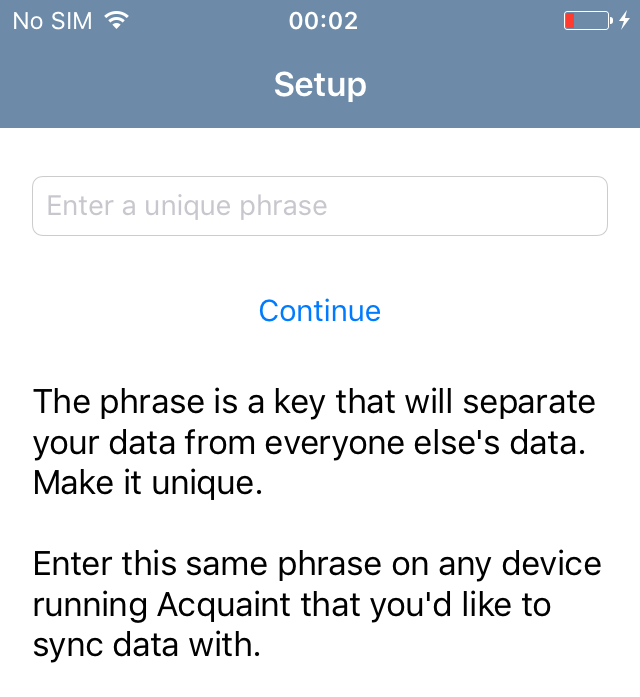

.. role:: definition(strong)

.. default-role:: definition

Quamotion Hands-On Lab
======================

Estimated time to complete this lab: **60 minutes**

Lab Objectives
--------------

This lab provides an end-to-end tour of the Quamotion Webdriver. You will start with a brief
exploration of the Quamotion UI, and then move on to an introduction on mobile test automation.

You will learn how to install a mobile app on a mobile device. Next, you will learn how to
inspect the user interface of a mobile app and to automate individual user interactions with
that mobile app. You will then use that knowledge to automate a full end-to-end scenario.
Finally, you'll learn how use the mobile quality dashboard to assess the quality of your
mobile app on different devices and platforms.

After completing this lab, you will be better able to:

* Use the Quamotion user interface
* Identify the elements that make up the user interface of a mobile app
* Automate user interactions with the mobile app
* Create mobile test automation scripts
* Run mobile test automation scripts
* Assess the quality of your mobile app

Technologies
------------

In this hands on lab, you'll use the following technologies:

* Quamotion for Windows
* Windows PowerShell

Audience
--------

This hands on lab targets the following audience:

* Test automation engineers

Scenario
--------

This lab takes you through a tour of Quamotion for Windows using PowerShell, with emphasis
on automating a mobile app and analyzing the quality of that mobile app.

Getting Started
---------------

Connect to the Lab Environment
~~~~~~~~~~~~~~~~~~~~~~~~~~~~~~

Ensure you are logged on to the Quamotion machine as a normal user.

Open the Lab Environment
~~~~~~~~~~~~~~~~~~~~~~~~

1. Make sure you have the latest version of the demo application available. In this lab, we'll
   use the Acquaint app. Download the Acquaint app at http://cdn.quamotion.mobi/apps/acquaint-android-151.apk
   and http://cdn.quamotion.mobi/apps/acquaint-ios-151.ipa, and save the files on the lab machine.
2. Make sure at least an iOS device (such as an iPhone) and an Android device (such as a Google Nexus device)
   are connected to the lab machine. Verify the devices are connected to the lab machine using an USB cable.
3. If the Quamotion software is not already running, start it by launching ``Quamotion.WebDriver.exe``. Leave
   the main executable running in the background.
4. To begin the lab, on the lab machine, start a browser, such as Google Chrome, and navigate
   to the Quamotion user interface at http://localhost:17894/.

Excercise 1 - Explore the Quamotion User interface
--------------------------------------------------

Estimated time to complete this excercise: **10 minutes**

Scenario
~~~~~~~~

In this introduction to the Quamotion User Interface, you will open the Quamotion user Interface and
explore the different components of the user interface. You will see that Quamotion provides you a single
entry point to manage your apps, your devices and the results of your test campaigns.

Task 1 - Applications in Quamotion
~~~~~~~~~~~~~~~~~~~~~~~~~~~~~~~~~~

In this task, you will access the `Apps` page, add the Acquaint application and list all applications
which are available for testing.

1. Ensure that you are connected to the Quamotion machine as a normal user.
2. Start a browser and navigate to http://localhost:17894/
3. In the top navigation, click `Apps`.
4. You will now see a list of all applications which are available for testing. By default, this list is empty.

   .. image:: apps-empty.png
      :width: 100%

5. At the bottom of the page, click the `New` button. The `New App` dialog appears
6. Click the `Choose File` button, and select the ``acquaint-ios-151.ipa`` file which
   you've downloaded earlier.
7. Click `Add` to add the application.
8. The `New App` dialog closes, and the `Apps` screen becomes visible. The Acquaint app
   is now listed in the list of available applications.

   .. image:: apps-acquaint.png
      :width: 100%

9. Click on the Acquaint app. A dialog box opens with additional information about the app. You can also
   download the app, or delete the app, from within this dialog box.

Task 2 - Devices in Quamotion
~~~~~~~~~~~~~~~~~~~~~~~~~~~~~

In this task, you will access the `Devices` page, connect and disconnect a device to your PC, and notice
how the `Devices` page automatically refreshes.

1. In the top navigation, click `Devices`.
2. You will see a list of all iOS and Android devices which are available for testing. If no iOS or Android 
   devices are devices to your PC using an USB cable, this list is empty.
   
   .. image:: devices-empty.png
      :width: 100%

3. Connect an iOS device to your PC. The `Devices` page will automatically update, and list the new iOS device
   which you have connected. 
   
   .. image:: devices-ios.png
      :width: 100%

4. Click on the iOS device you have connected. A dialog appears, which shows additional information about your
   device.

5. Unplug the USB cable of your iOS device from your PC. The device is removed from the `Devices` screen.

Task 3 - Spying the user interface of an application
~~~~~~~~~~~~~~~~~~~~~~~~~~~~~~~~~~~~~~~~~~~~~~~~~~~~

In this task, you'll use the `Spy` page to spy on the user interface of an application. When spying you'll be
able to inspect the individual elements of the application's  UI. You can later use these elements in your
automation scripts.

You'll see how to write automation scripts in a next excercise.

1. In the top navigation, click `Spy`. The `Spy` page opens.
   
   .. image:: spy-empty.png
      :width: 100%

2. The `Spy` page allows you to launch an app on a device, and inspect the user interface of that app. To launch
   the app, you'll first need to specify which app you want to run, and on which device you want to run it.

   In the `Platform` dropdown, select `iOS`, in the `App` dropdown, select `Acquaint N`, and in the `Device`
   dropdown, select your iOS device.

   .. image:: spy-starting-top.png
      :width: 100%

3. After a couple of seconds, the screen of your device will be mirrored in your browser.

   .. image:: spy-starting-bottom.png
      :width: 100%

4. Click `Start` to install and launch your application on the device. Wait for your application to launch.

5. You can now inspect the user interface of your app. Click any element in the user interface. The element
   will be highlighted in a red rectangle.

   .. image:: spy-running.png
      :width: 100%

6. Review the contents in the lower right of your browser window. You'll see a tree view, which represents
   all user interface elements of your application, which are related to the element you've just selected.
   The tree view contains the XPath expression which you can use to identify the element and, where available,
   the ID, text or accessibility label of the element.

   .. image:: spy-tree-details.png
      :width: 50%

7. Review the contents in the upper right of your browser window. You'll see a table, which contains additional
   information about the element you've just selected. You'll see the XPath you can use to identify the element,
   as well as some additional information, such as the class name, ID and rectangle.

   .. image:: spy-xpath-details.png
      :width: 75%

8. Click on the `Play` icon. Additional properties of the element which you've selected are now displayed.
   You can use the text box to filter the properties which are being displayd. Enter the text ``access```
   in the text box. Now only properties related to accessibility are being displayed.

   .. image:: spy-xpath-properties.png
      :width: 75%

Task 4 - Using the Mobile App Quality Dashboard
~~~~~~~~~~~~~~~~~~~~~~~~~~~~~~~~~~~~~~~~~~~~~~~

In this task, you'll use the `Dashboard` app to view the results of the test scripts you've executed.

1. In the top navigation, click `Dashboard`. The `Dashboard` page opens.
   
   .. image:: dashboard.png
      :width: 100%

2. The two top pie charts in the `All Results` section display the number of tests you've executed,
   and the number of devices on which you've executed those tests.

3. The `Key Metrics` section displays key metrics about your test campaign - such as the total device
   time, the number of devices and operating systems, and the size of the application under test.

4. The `Failure Breakdown` section displays the test results by operating system, form factor and
   manufacturer.

5. You can click any link the failure breakdown section to view more information about those failures.
   Click on any link in the operatig system section.

6. The `Test Result Details` page will appear. This page contains all tests you've executed which match
   the criteria you've specified. 

   .. image:: test-result-details.png
      :width: 100%

7. Click on any test in the test results list.

8. The test report appears. The test report contains a detailed view of all steps that have been
   executed in the test report, including screenshots.

   .. image:: test-report.png
      :width: 100%

Excercise 2 - Automate the Acquaint application on iOS
------------------------------------------------------

Estimated time to complete this excercise: **30 minutes**

Scenario
~~~~~~~~

In this scenario, you'll automate the iOS version of the Acquaint application. The acquaint app is a simple
list of contacts, each of which can be viewed in a detail screen and modified in an edit screen. It runs on iOS 9
and above.

You will learn how to:

* Create a mobile test automation script
* Automatically launch an application on a mobile device
* Automate user interactions, such as scrolling, tapping and typing text
* Analyze the test results

Task 1 - Explore the Acquaint application
~~~~~~~~~~~~~~~~~~~~~~~~~~~~~~~~~~~~~~~~~

You'll first explore the Acquaint application. You will now manually execute the scenario you will later automate.

1. On your iOS device, if it is not already active, launch the Acquaint app. The Acquaint app was installed
   previously on your device when you launched the spy.

2. If you are requested to connect to a data source, enter the value ```UseLocalDataSource`` as the data source
   and continue to the next page.

3. In the list of acquaintances, scroll down until you find `Green, Monica`. Tap `Green, Monica`.

4. The details page for Monica Green will now open, including a mapp which visualizes her address. Tap the pencil
   icon in the upper right corner of the device to edit her details.

5. Scroll down until you find the `ZIP` field in the contact details.

6. Tap the zip code. The on screen keyboard of your device will now appear. Enter a new zip code, for example,
   `100 44`, which is the zip code for Stockholm.

7. Tap the save icon in the upper right corner of the app to save your changes. Make sure the zip code is displayed
   correctly.

8. Tap `List` to go back to the main screen.

Task 2 - Create a script which launches the application
~~~~~~~~~~~~~~~~~~~~~~~~~~~~~~~~~~~~~~~~~~~~~~~~~~~~~~~

In this task, you'll create your first mobile test automation script. There are plug-ins for Quamotion that allow
you to write tests in Java, C# or PowerShell. 

In this task, you'll use PowerShell. Because PowerShell is a scripted language, and not a compiled language, it
is easier to create and edit scripts as you go. However, all the scripts you're about the write in PowerShell
could easily be written in Java or C#.

If you're using the Quamotion machine, PowerShell is already installed. PowerShell is also available on Windows
by default. If you're using Linux or macOS, download PowerShell from https://github.com/PowerShell/PowerShell/

Because Quamotion is based on the WebDriver protocol, it also implements most of the concepts of WebDriver.
One fundamental concept in WebDriver is the notion of a `session`. You can think of a session as a test run.
In the context of Quamotion, a `session` is an application running on a device.

When you start a new test script, the first step is usually to create a session. You can do so using the
``New-Session`` command. When starting a session, you specify the application you want to launch (by its
unique ID and version number) and the device on which you want to launch the application (by its serial number).

You can use the portal to get the unique ID and version number of the mobile app and the serial number of the device,
or you can use the ``Get-App`` and ``Get-Device`` commands in PowerShell.

1. As a first step, open PowerShell. Click `Start`, type `PowerShell` and hit ENTER. The PowerShell console
   will now open.

   .. image:: powershell.png
      :width: 100%

2. Next, you'll need to import the Quamotion module into your PowerShell session. Assuming you've installed
   the Quamotion software to ``C:\Quamotion``, type the following command and hit ENTER:

  .. code-block:: powershell

     PS> Import-Module C:\Quamotion\wdclient.psm1

3. To get the application ID and version number of the Acquaint app, run the `Get-App` command:

  .. code-block:: powershell

     PS> Get-App

     AppId                   : demo.quamotion.Acquaint
     DisplayName             : Acquaint N (1.51)
     Version                 : 1.51
     VersionDisplayName      : 1.51
     SupportedConfigurations : @{OperatingSystem=iOS; [..]}
     TestServerVersion       :

4. Note that the application ID is ``demo.quamotion.Acquaint`` and the version number is
   ``1.51``.

5. To get the unique ID of your device, run the `Get-Device` command:

  .. code-block:: powershell

     PS> Get-Device

     configuration  : @{OperatingSystem=iOS; [..]}
     deviceRotation : None
     manufacturer   : Apple
     model          : iPhone6,2
     name           : iPhone
     providerId     : 61fee998-7171-4b09-9d8a-511136d30ec9
     resolution     : @{x=0; y=0; width=640; height=1136}
     serialNumber   : 221373bf136e8e8962fe978e74f4c92af330c6ba
     state          : Started
     type           : Physical
     uniqueId       : 221373bf136e8e8962fe978e74f4c92af330c6ba
     viewPort       : @{x=0; y=0; width=640; height=1136}
     deviceModel    : @{[..]}

6. A lot of information about your device is provided to you. Write down the unique ID,
   ``221373bf136e8e8962fe978e74f4c92af330c6ba`` in this case.

  .. note::

    Because the unique ID uniquely identifies the device, you may obtain a different unique ID
    with your iOS device.

7. To start a new session on the device, run ``New-Session`` command. Specify the unique ID of your
   device using the ``-deviceId`` parameter and the ID and version of your app using the
   ``appId`` and ``appVersion`` parameters, respectively.

   Because the Acquaint app stores the secret key you've used, you may want to reinstall the application
   on the device every time you create a new session. This way, you're sure your application starts
   in a clean state, every time you run a test.

   Finally, because only one app can run on a device at the same time, you may want to remove any
   previous session. You can do so using the ``Get-Sessions | Remove-Session`` command

  .. code-block:: powershell

    PS> Get-Sessions | Remove-Session
    PS> New-Session 
          -deviceId 221373bf136e8e8962fe978e74f4c92af330c6ba
          -appId demo.quamotion.Acquaint
          -appVersion 1.51
          -reinstallApp $true

    The session b59649cb-6324-400b-923c-8384b4fcd6f3 is Deploying: [..]
    The session b59649cb-6324-400b-923c-8384b4fcd6f3 is Deploying: [..]
    The session b59649cb-6324-400b-923c-8384b4fcd6f3 is Deploying: [..]


Task 3 - Automate the Acquaint setup
~~~~~~~~~~~~~~~~~~~~~~~~~~~~~~~~~~~~

The first time you launch Acquaint, it will ask you to configure a unique passphrase.
In this task, you'll write a script which enters the unique passphrase and then taps
`Continue`.



To automate gestures on controls, such as tapping, you can use PowerShell functions
like `Click-Element`. When automating a gesture, you need to instruct Quamotion on
which user interface element you want your script to perform the gesture.

There are various ways to identify an control. You can identify a control by
the text it displays, its accessibility label or its unique ID (if one is assigned
to the control by the application's developers). Alternatively, you can also
specify the control's class name or provide an XPath expression which uniquely
identifies the control. To retrieve the class name or XPath expression, you can use
the `Spy` window you've explored in the previous excercise.

To type text, you can use the `Enter-Text` PowerShell function.

In this case, we want to enter text in the text box which displays the text 
`Enter a unique phrase`. You can pass the ``-marked`` parameter to the ``Click-Element``
function to instruct the ``Click-Element`` function to click on that control.

1. To simulate a tap on the text box which displays the text `Enter a unique phrase`,
   enter the following command in PowerShell:

  .. code-block:: powershell

    PS> Click-Element -marked "Enter a unique phrase"
    
2. The on-screen keyboard will now appear 

  .. image:: acquaint-setup-entering-text.png
    :width: 33%

  Type ``Enter-Text "UseLocalDataSource"`` to simulate the user typing the 
  `UseLocalDataSource` text

  .. code-block:: powershell

    PS> Enter-Text "UseLocalDataSource"

3. Finally, you can simulate a tap on the `Continue` button by using the ``Click-Element``
   method.

  .. code-block:: powershell

    PS> Click-Element -marked "Continue"

  The application will now launch the `Acquaintances` screen.

Task 3 - Open an acquaintants details
~~~~~~~~~~~~~~~~~~~~~~~~~~~~~~~~~~~~~

In this task, you'll open the details page for an acquaintance.
You'll use an acquaintce with a last name which starts with 'T' requiring you write a script
which scrolls down to that acquaintance in the contact list.

To scroll down to an element, use the ``Scroll-To`` method. However, you need to specify
which scroll view you want to scroll in. To obtain a reference to the scroll view, you
can use the ``Get-Element`` function. Because scroll views on iOS implement the ``UITableView``
class, you can search by class.

1. To scroll down to the `Thornton, Vanessa` contact, run the following code:

   .. code-block:: powershell

     PS> $scrollView = Find-Element -class "UITableView"
     PS> Scroll-To -elementId $scrollView -marked "Thornton, Vanessa"

   The application will now scroll down the main scroll view, until the `Thornton, Vanessa`
   acquaintance is visible.

2. To open the details for Vanessa, use the ``Click-Element`` function:

   .. code-block:: powershell

     PS> Click-Element -marked "Thornton, Vanessa"

   Vanessa's contact details will appear.

Task 4 - Edit an acquaintants details
~~~~~~~~~~~~~~~~~~~~~~~~~~~~~~~~~~~~~

Once you've opened the contact card for Vanessa, you'll want to automate a tap on the edit icon,
represented by the pencil, in the upper right of the screen.

Because this icon does not contain any visual text, you cannot use the ``Click-Element`` function
with the ``-marked`` parameter like we've done previously. Instead, you'll need to open the `Spy`.

1. In your browser, navigate to the `Spy` page.
2. Select the `iOS` platform, the `Acquaint` app and your device. Because you've already opened
   a session for the Acquaint app on your device, you'll also need to check the
   `Reuse an existing session if available` check box.
3. Click `Start` to start the spy.
4. In the mirror of your devices screen in your browser, click the pencil icon.

  .. image:: acquaint-details-spy.png
    :width: 100%

5. Note how the details section also displays the unique ID of the edit icon.

  .. image:: acquaint-details-properties.png
    :width: 100%

6. Now you know the unique ID of the edit icon is ``edit``, you can use the ``Click-Element``
   method to automate a click:

   .. code-block:: powershell

     PS> Click-Element -marked "edit"

   The edit screen will apear.

7. To update the zip code, you'll first need to scroll down to the `ZIP` entry. You can use the same
   technique you've learned in the previous step:

   .. code-block:: powershell

     PS> $scrollView = Find-Element -class "UITableView"
     PS> Scroll-To -elementId $scrollView -marked "ZIP"

8. To edit the zip code, similate a tap on the current zip code (`94070`):

   .. code-block:: powershell

     PS> Click-Element -marked "94070"

9. Clear the text, enter a new zip value and dismiss the keyboard to stop editing:

   .. code-block:: powershell

     PS> Clear-Text
     PS> Enter-Text 100 44
     PS> Dismiss-Keyboard

10. Finally, navigate back to the main list of acquaintances by tapping `Details` and `List`:

   .. code-block:: powershell

     PS> Click-Element -marked "Details"
     PS> Click-Element -marked "List"