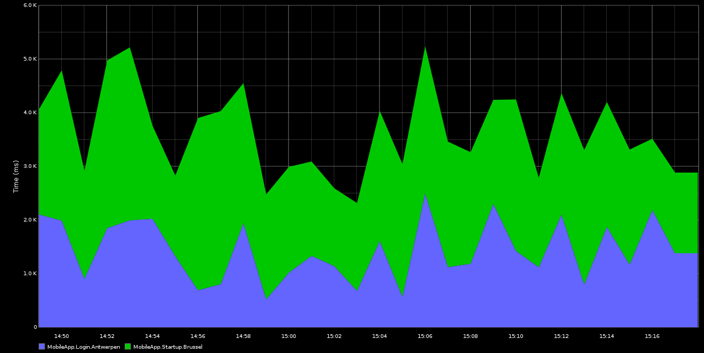
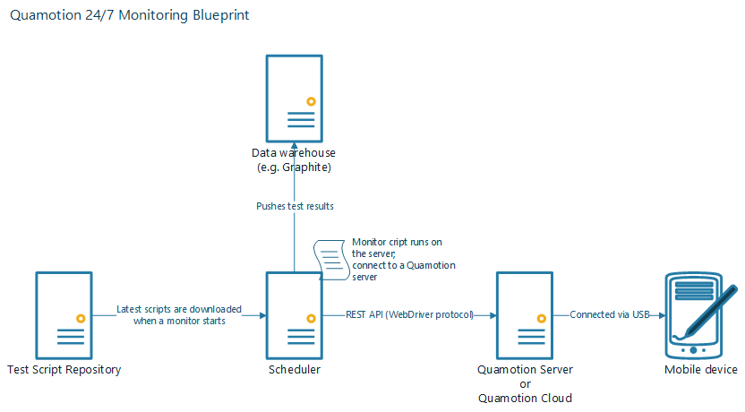

24/7 Mobile Application Monitoring with Quamotion
=================================================

You can use Quamotion, together with monitoring software, to continuously monitor the performance of mobile applications.

Let's imagine that you have a consumer application, and you want to measure how long it takes to launch the application
and sign into the application in different cities, and using different network operations.

You may want to obtain graphics like the one below, which shows the timings of the Launch and Sign In operations for
different geographical locations, over time:

In that scenario, you can create a single script (using PowerShell or another scripting language), which automates these
actions and records the time it takes to execute every step.

You can deploy Quamotion to a server in different physical locations, to which you connect physical mobile devices connected
to various mobile networks.

Next, you enhance your script so that it reports back the timings to a montoring solution, such as `Graphite <http://graphiteapp.org/>`_,
or Microsoft System Center Operations Manager.

Finally, you configure your server to launch your Quamotion scripts on a schedule - for example, every 5 minutes.

In this How-To guide, we'll walk you through the steps required to setup such a configuration using Quamotion and Graphite

Overview
--------

You'll need to deploy at least the following components:

1. A data warehouse, to which you submit the measuruments and which stores the data. In this example, we will use
   `Graphite <http://graphiteapp.org/>`_ as the data warehouse
2. A test script repository in which you store your test scripts. For example, you can use GitHub as your repository.
3. A scheduler which runs your Quamotion scripts on a schedule. For example, you can use a CRON script to run your
   scripts every 15 minutes.
4. A Quamotion server to which your mobile devices are connected.

Deploying the Graphite server
-----------------------------

The easiest way to deploy a simple Graphite server is using `Vagrant <https://www.vagrantup.com/downloads.html>`_ and the 
`Graphite Synthesize <https://github.com/obfuscurity/synthesize>`_ script.

To configure a Graphite server, run the following commands:

.. code-block:: shell

    git clone https://github.com/obfuscurity/synthesize
    cd synthesize
    vagrant up

It will take a couple of minutes for your Graphite server to become available. Once your server is up and running,
you can connect to it by navigating to http://localhost:8443/.

Deploying the Quamotion server and run scripts on a schedule
------------------------------------------------------------

You can use the standard instructions from our Getting Started guide to deploy a Quamotion server.
To run tests on a schedule, use a scheduler such as the Windows Task Manager (Windows) or cron (macOS and Linux)
to run the tests on a schedule.

