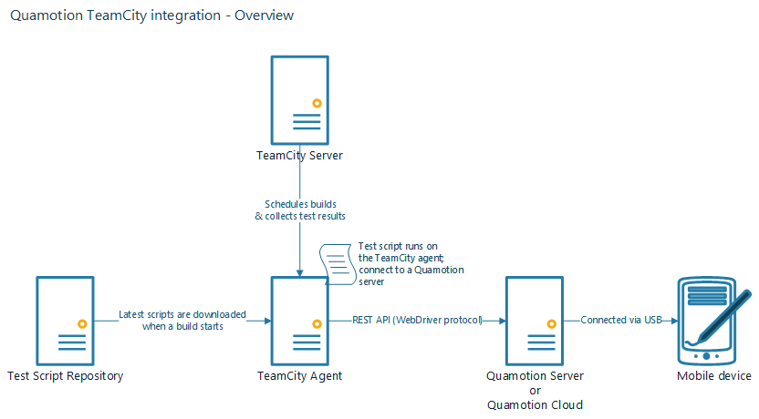
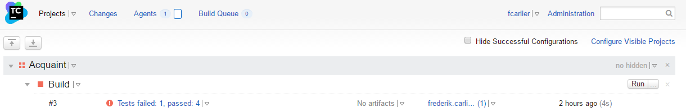
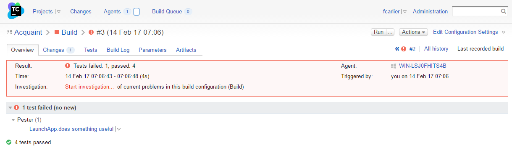

Run Mobile UI Tests in TeamCity
===============================

In this How-To, we'll configure TeamCity so that it automatically runs mobile UI tests as part
of a TeamCity build.

We're assuming you're writing your test cases in PowerShell using Pester, and you're using Git
to store your test scripts, but the same setup will also work for other combinations.

Overview
--------

You'll create a new TeamCity project which will execute mobile UI tests and reports the results to
TeamCity. You'll configure a build phase which executs the mobile tests and save the results to an
``.xml`` file. Then, you'll configure the build features so that TeamCity is able to read the test
results in that file.

You'll need the following components to get started with Quamotion and TeamCity:

1. A server on which Quamotion is running. If you're using the cloud scale out, we host
   this server for you. If you're hosting Quamotion on premises, you'll need to install
   Quamotion on a server in your network. If you only have one TeamCity agent, you can
   install Quamotion on your TeamCity agent; otherwise, you'll need a dedicated machine.
2. A set of test cases which you want to run as part of your TeamCity build. For example,
   you can write these tests as JUnit, Cucumber or Pester (PowerShell) tests. In this
   how-to guide, we're using Pester tests.
3. A repository in which you want to store your tests.  You can choose to store your tests
   in the same repository as your source code, or you can store it in a seperate repository.
   In this walkthrough, we'll use a dedicated repository, hosted on GitHub.
4. A TeamCity installation with at least one agent.

Creating the TeamCity project
-----------------------------

Follow these steps to create a new TeamCity project:

1. Open TeamCity and log in using an account with administrative credentials.
2. Click `Administration` to open the TeamCity administration.
3. Click the `Create project` dropdown button to create a new project, and select `Pointing to repository url`.
4. Provide the information about the GitHub repository in which you're storing your tests, and click `Proceed`.
5. Confirm the project name and build configuration name and click `Proceed`.

Configuring the build steps
---------------------------

Follow these steps to specify the build steps for your TeamCity project. You'll configure TeamCity build so that
the build executes the mobile UI tests, and saves the results in an ``.xml`` file.

1. Although TeamCity automatically detects some build steps, these build steps do not fully support
   runing mobile UI tests. Click `Build Steps` in the left-hand menu to go to the `Build Steps` window.
2. Click `Add build step` to create a new build step
3. Select `PowerShell` as the runner type, and specify `Source Code` as the `Script` option.
4. Use this script as the PowerShell script content. This script will run the Pester tests and save the test results
   in a ``.xml`` file, which TeamCity can then use to analyze the test results.

   .. code-block:: powershell

      Import-Module Pester
      Invoke-Pester -OutputFile results.xml -OutputFormat NUnitXml

5. Click `Save` to save the build step.

Configuring the Build Features
------------------------------

Follow these steps to specify the Build Features for your TeamCity project. You'll configure the features so
that TeamCity is able to import the test results.

1. Click the `Build Features` link in the left-hand menu.
2. Click the `Add build feature` button
3. Select `XML report processing` option.
4. Set the `Report Type` to `NUnit` and enter ``results.xml`` in the `Monitoring Rules` text box.
5. Click `Save`

That's it! You have now successfully configured your first test project.

Running your TeamCity build
---------------------------

To run your build, go back to the TeamCity home package and select your project. Then, click the `Run` button and
wait while your build is executing.

Once your test has completed, you'll find an overview of the tests which have passed and failed, integrated in
TeamCity. You can click on the test results link to get more information about the test results.

